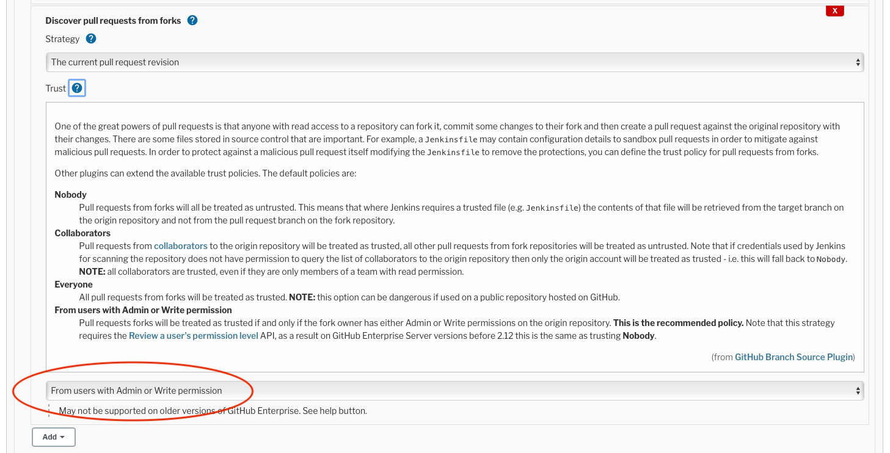

# Open Source Software Supply Chain Best Practices at the Eclipse Foundation

With the [increasing number of software supply chain attacks](https://github.com/cncf/tag-security/tree/main/supply-chain-security/compromises), we've defined a (non-exhaustive) list of best practices that we encourage Eclipse Foundation committers and projects to follow. Note that we also listed some best practices that may require the Eclipse Foundation to step in in order to make them achievable or easier to implement.

Building open source software is increasingly complex and distributed. It is a process comprised of many packages which are retrieved, digested and stored and where any flaw can be a vector of a supply chain attack as depicted on the picture below from the [SLSA security framework](https://slsa.dev/levels#threats).

Proper threat modeling of each step is required in order to mitigate any such flaw. However, there is no one-size fits all in terms of threat modeling, so we just enumerate some common best practices defending against the most common attacks.

This work takes inspiration in various publications from entities like the [CNCF](https://github.com/cncf/tag-security) and the [Linux Foundation](https://www.linuxfoundation.org/resources/publications/open-source-software-supply-chain-security/).

## Protect the code repositories

The first artifact that needs to be protected in the software supply chain is the actual source code. The best practices below aims at preventing that unintentional commits gets into the source code repository.

### Strengthen the git authentication methods

Committers shall use [long, strong passwords](https://pages.nist.gov/800-63-3/sp800-63b.html#appA) for their Eclipse Foundation account. Rule number 1 is that length trumps complexity, so a long passphrase is always secured. If the password is randomly generated, then a shorter password could be used (12 characters minimum).

Committers should also enable two-factors authentication (2FA) or multi-factors authentication (MFA) wherever possible. It is currently possible on [GitHub](https://docs.github.com/en/authentication/securing-your-account-with-two-factor-authentication-2fa/configuring-two-factor-authentication), and on [Eclipse Foundation's GitLab](https://gitlab.eclipse.org/help/user/profile/account/two_factor_authentication.md).

Note that Eclipse Foundation's accounts do not yet support MFA. See [issue 576311](https://bugs.eclipse.org/bugs/show_bug.cgi?id=576311).

If you generated your SSH key a long time ago, it is advised to rotate it. Meanwhile, you should make it long (at least 4096 bits for RSA) or use newer, stronger algorithms (e.g., `Ed25519`).

### Require signed commits

For additional security, projects can require all commits to be signed with GPG or S/MIME signature. On [GitHub](https://docs.github.com/en/repositories/configuring-branches-and-merges-in-your-repository/defining-the-mergeability-of-pull-requests/about-protected-branches#require-signed-commits) and [Eclipse Foundation's GitLab](https://docs.gitlab.com/ee/user/project/repository/gpg_signed_commits/), this can be enabled as a branch protection rule, meaning that commits that are not signed get rejected. In both cases, you should open a ticket with webmaster to get it activated.

It's not possible on Gerrit to protect commits before push, but projects can still define policies in order to verify, e.g., before doing a release, that all commits since the previous release are properly signed with known keys.

### Disable force-push

In addition to [not be being courteous to other committers](https://www.git-tower.com/blog/force-push-in-git/), force push can be used to create commits seemingly legit but introducing malicious changes (e.g., in case of impersonification of a committer after a credentials leak). At least the `main` branch should be forbidding force-push. This is normally properly configured on all Eclipse Foundation projects repositories. In case of doubt, open a request to webmasters.

### Require reviews before merging

Protecting the `main` branch from direct push by requiring pull requests / reviews is a way to lower the chances for a malicious change to be included silently into the repository.

In addition to the expected code quality improvment and knowledge dissemination it provides, systematic code review mostly protects against committers identity theft and rogue behaviors in the context of an Eclipse Foundation project where write permissions are only granted to elected committers.

### Review external services having access to repositories

It's a common practice nowadays to rely on external services (e.g. GitHub apps) for static code analysis, secrets detection, auto-triage of issues, etc. Those services requires various permission levels. Permissions must be granted on the principle of least privilege. If an app requires more permissions than needed, it must not be installed.

Connected apps shall be reviewed frequently and the ones that are not used anymore must be revoked. There has been a couple of issues with such apps the last couple of year (e.g., [Travis CI](https://arstechnica.com/information-technology/2021/09/travis-ci-flaw-exposed-secrets-for-thousands-of-open-source-projects/), [CodeCov](https://about.codecov.io/security-update/)), and it becomes a major concern.

## Securing third-party artifacts

Source code is only part of the equation when building software. Many dependencies are retrieved and included as part of the build pipeline. It is important to ensure that retrieved dependencies are the expected ones, and that they have not been tempered with.

Parts of securing third-parties dependencies is already covered by the [Eclipse Foundation intellectual property due diligence process](https://www.eclipse.org/projects/handbook/#ip) which aims at ensuring license compatibility. By doing so, it requires projects to have a good understanding of their dependencies. Some best practices below will highlight *some* ways to have an even better understanding.

### Use `https` only to retrieve dependencies

Retrieving dependencies over the web must be done over secured connection, aka `HTTPS`. This will be prevent man-in-the-middle (MITM) attack that could temper with the dependency. Some tooling, like Maven can be configured to block access to all `HTTP` repositories. Since Maven 3.8.1, [it is the default](https://maven.apache.org/docs/3.8.1/release-notes.html#cve-2021-26291).

### Use *trusted*, primary registries

Getting dependencies from non well-known registries shall be avoided. Only the most trustworthy sources, like central registries (e.g., Maven Central, npmjs.com, or crates.io), must be used.

### Review your dependencies and pay attention to typo-squatting

Dependencies names must scrutinized for typos to avoid dependending on malicious code. This must be done during code reviews and may be done in regular dependencies audit (e.g., at release time). Extra care should be taken to identify similar Unicode characters ([homoglyph](https://en.wikipedia.org/wiki/Homoglyph)), and even ASCII ones like `1` and `l` or `0` and `O`.

### Verify checksums and signatures of all downloaded dependencies

Checksums must always be verified, even when downloading dependencies over `HTTPS`. Checksums are usually served from different servers or different storage backends and it may not be easy for an attacker to silently change both the artifact and its checksum file. Some build tools can be told to enforce checksum verification, e.g., Maven has `-C` or `--strict-checksums` argument.

When available, digital signatures should be checked that they have been issued by its expected creators.

## Securing Build Pipelines

The build pipeline by nature has a high level of permissions over the source code repository but also on the deployment environment. If compromised, it can be used to introduce undetectable malicious changes to the source code or its dependencies and make the project delivers what it think a perfectly clean output. This is what happened to [SolarWind](https://github.com/cncf/tag-security/blob/main/supply-chain-security/compromises/2020/solarwinds.md) in 2020.

### Use immutable build pipelines

Build scripts shall be checked in the code repositories and should only be modified in there. Having build pipelines versioned along with the code ensures that only committers with write permissions on the code can modify the build pipeline. Also, it makes it easier to review and verify the pipeline for later audit, e.g., in case of an incident.

Committers can use Eclipse Foundation's CI service based [Jenkins](https://wiki.eclipse.org/Jenkins), with [Jenkins pipeline](https://www.jenkins.io/doc/book/pipeline/), independently from where the code is hosted. It is especially important for project using Jenkins Freestyle jobs to [convert their jobs to Jenkins pipeline](https://docs.cloudbees.com/docs/admin-resources/latest/pipelines/declarative-pipeline-migration-assistant).

When hosted on GitHub, projects can use GitHub actions with similar benefits.

### Use a vault to store and access secrets during build

Secrets required during a a build pipeline (ssh keys, registry credentials...) must not be stored in the git repository and must not be stored in the pipeline configuration. Tools should be used to detect or prevent committing secrets to the repositories: Git hooks that run on your computer, e.g. [git-secrets](https://github.com/awslabs/git-secrets) from AWS Labs, [GitHub secret scanning](https://docs.github.com/en/code-security/secret-scanning/about-secret-scanning), or [GitLab secret scanning](https://docs.gitlab.com/ee/user/application_security/secret_detection/).

Some secrets storage mechanism or vault must be used in order to get those secrets: GitHub actions use [encrypted secrets](https://docs.github.com/en/actions/security-guides/encrypted-secrets) and Jenkins has a number of plugins providing [credentials bindings](https://www.jenkins.io/doc/book/using/using-credentials/).

Most of those solutions export the credentials as environment variables. Those variables should never be printed to standard output (even if obfuscation is handled by the CI system).

Finally, when using shell scripts, always favor passing secrets via `stdin` rather than as command line arguments. Command parameters can be viewed by any user logged on the system (e.g, with `ps aux`).

### Do not start build automatically from untrusted sources

It is a great added value to be able to build new contributions from non-committers when they submit a new piece of code for review. However, great care must be taken at the CI level to avoid granting too much permission to such builds.

On GitHub actions, [workflows from public forks require approval](https://docs.github.com/en/actions/managing-workflow-runs/approving-workflow-runs-from-public-forks) for first-time contributors by default. This shall be changed to `Require approval for all outside collaborators`. In all cases, committers should be be especially alert to any proposed changes in the `.github/workflows/` directory that affect workflow files.

On [Jenkins](https://wiki.eclipse.org/Jenkins), depending on which git hosting is used, the situation differs. Jenkins and Gerrit integrations are not safe to use, be it via the [Gerrit Code Review plugin](https://plugins.jenkins.io/gerrit-code-review/) or the [Gerrit Trigger Plugin](https://plugins.jenkins.io/gerrit-trigger/). While the former is made to be used in a pipeline job, none checks for user permissions before starting a build. Any external contribution triggers a build, which mean that any malicious code can be executed as a result.

The Gerrit Trigger Plugin has one advantage as it has a configuration that prevent a build from being triggered if the review contains changes to some files. Note that it does not discriminate committers and non-committers, preventing build to be triggered for both categories.

This shall be used to exclude all changes modifying a build pipeline related files (e.g., `Makefile`, `pom.xml`, shell scripts that gets executed...) from automatically triggering a build.

When using [Jenkins](https://wiki.eclipse.org/Jenkins) pipelines with GitHub or GitLab hosted repositories, the configuration of the branch source configuration must be done carefully. More specifically, in order to protect against a malicious pull request itself modifying the `Jenkinsfile` to remove the protections, the trust policy for pull requests from forks shall be set to `From users with Admin or Write permission`.

It will only protect the `Jenkinsfile` file by default. Any other pipeline related file (e.g., `Makefile`, `pom.xml`, shell scripts that gets executed...) that can execute some code should be protected as well. The [`readTrusted`](https://www.jenkins.io/doc/pipeline/steps/workflow-multibranch/#readtrusted-read-trusted-file-from-scm) step must be used to do so.

## Protect build outputs

Once the binaries are produced, downstream consumers should have a way to verifiy that what they get is what the project published, i.e., that it has not been tempered with during transfer or by a compromised build pipeline.

### Sign everything

All produced artifacts should be digitally signed with a project specific key. The Eclipse Foundation manages a GPG-based web of trust, mostly for letting project [publish artifacts to Maven Central](https://wiki.eclipse.org/Jenkins#How_can_artifacts_be_deployed_to_OSSRH_.2F_Maven_Central.3F). This infrastructure can be reused for GPG signing build artifacts and thus fullfilling this best practice.

### Use platform's code signing (Windows, macOS, JAR, ...)

When applicable, sign your code with code signing certificates. Compared to regular digital signature, this has the advantage to be checked by the deployment platform rather than relying on the user (or the provisionning software) to verify signature manually. It also prevents security warnings labels during download and install. Finally, some platforms add more requirements to just code signature (e.g. on macOS, applications shall be notarized) which increases protection against malware.

The Eclipse CBI project provides [services](https://wiki.eclipse.org/IT_Infrastructure_Doc#Sign_my_Jar.2Fplugins.2FWindows_exe.2FmacOS_App_files.3F) that let you sign your code with certificates owned by the Eclipse Foundation.

### Generate, publish (and sign) SBOM on release

A Software Bill Of Materials (SBOM) is a list of components in a piece of software. It is valuable both for consumers of the project and to the project itself to performs out of band vulnerability or license analysis. Those analysis are easier when using a well established format for such a SBOM. The most two commons are [CycloneDX](https://cyclonedx.org/) and [SPDX](https://spdx.dev).

License analysis can be done via the [Eclipse Dash License Tool](https://github.com/eclipse/dash-licenses). Note however that it does not yet read a SBOM format listed above, but rather a plain list of [ClearlyDefined coordinates](https://docs.clearlydefined.io/using-data#clearlydefined-coordinates).

### Make your build reproducibles

A [reproducible build](https://reproducible-builds.org) allows verification by a third party that no vulnerabilities or backdoors have been introduced during build pipeline. It lets them build the binaries on their own and let them verify that what they get is binary identical to the released artifacts.

The [reproducible-builds.org documentation](https://reproducible-builds.org/docs/) is full best practices and tips how to achieve that in various languages. There are pages specifically for artifacts targetting the [JVM](https://reproducible-builds.org/docs/jvm/). Also, both [Maven](https://maven.apache.org/guides/mini/guide-reproducible-builds.html) and [Gradle](https://docs.gradle.org/current/userguide/working_with_files.html#sec:reproducible_archives) have plugins and instructions to help projects achieve reproducibility.

## Protect deployments

### Software update systems

Software update systems are hard to design and hard to secure. They are an easy target as they eventually deploy binaries on clients' machines. To be considered secure, a software update system must ensure that:

* it knows about the latest available updates in a timely manner
* any files it downloads are the correct files, and,
* no harm results from checking or downloading files.

These are the foundations of [The Update Framework, TUF](https://theupdateframework.io/overview/). It has been designed with strategies against a [well defined threat model](https://theupdateframework.io/security/). A secure software update system must define mitigation against those attacks.

## Addendum

There are several assement tools and evaluation framework out there that projects should take in order to review the security of their software supply chain. The two most well known / up to date are:

* OSSF Security Scorecards: https://github.com/ossf/scorecard
* Secure Supply Chain Assessment from the CNCF Security Technical Advisory Group: https://github.com/cncf/tag-security/blob/master/supply-chain-security/supply-chain-security-paper/secure-supply-chain-assessment.md
* SLSA ("salsa") - Supply-chain Levels for Software Artifacts: https://slsa.dev